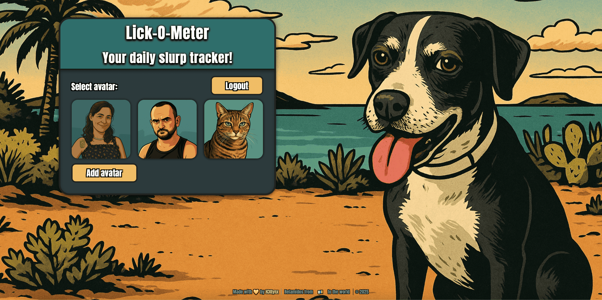
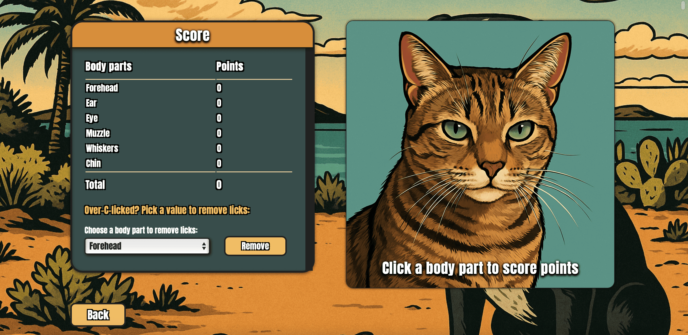

# RelAppmidos

## Project Description
A fun and interactive web app that tracks dogs' daily slurps and licks on their owner's face. Inspired by Sasha, my lively pitbull, who proved that pitbulls can be as affectionate as anyone with her famous “lick attacks.” This app showcases front-end skills using HTML, CSS, and JavaScript in a playful GTA comic style.

## Technologies Used
- HTML  
- CSS  
- JavaScript  

## Features
- Slurp counter game: Tap/click defined avatar zones with instant visual feedback.
- User authentication: Registration, login, and secure password validation.
- Captcha integration: Protects registration from bots.
- Guest mode: Try the game without logging in (slurps go to the cat, but not saved).
- Registered users can request their own avatar: the app can access the device’s front camera.

## Important Note
The live demo is currently disabled to manage backend resource costs, but this repository contains the full front-end code for the app.

## Screenshots
  
  

## Contribution
Contributions, suggestions, and feedback are welcome!